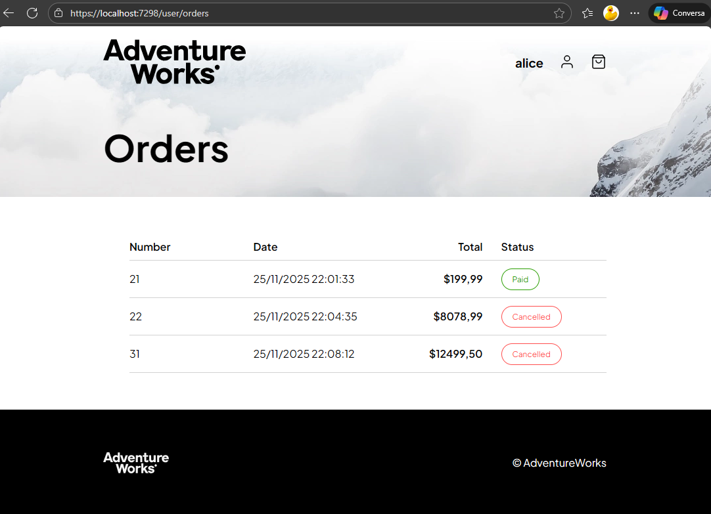
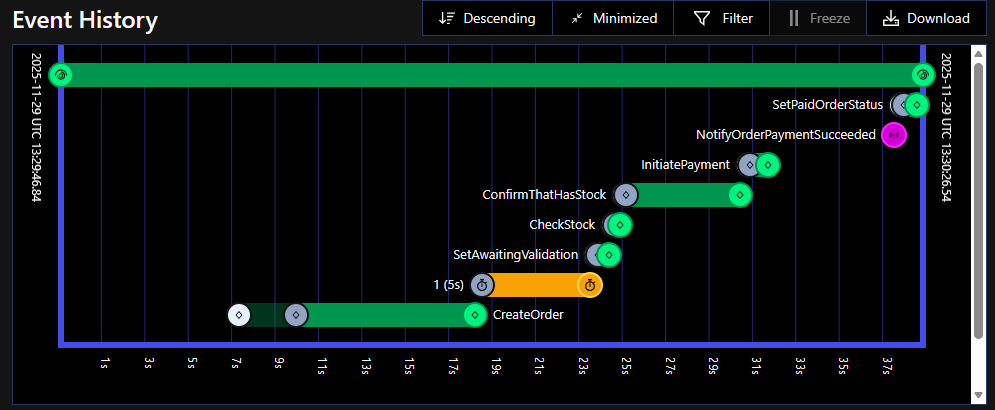
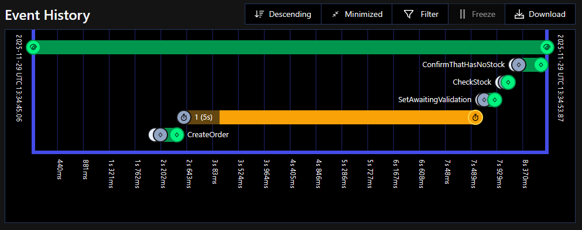
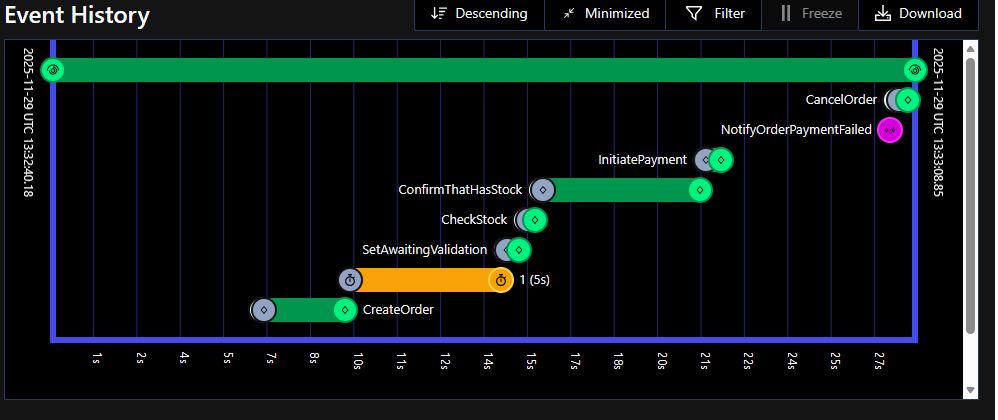
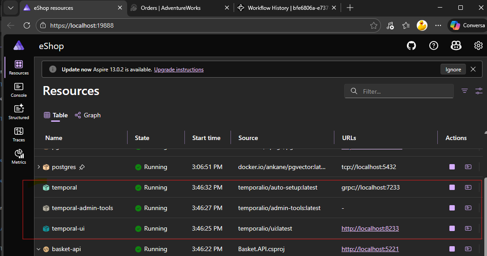

# eShopOnContainers + Temporal.io Workflows

This repository is an experiment in reimplementing the classic eShopOnContainers order saga using [Temporal.io](https://temporal.io/) workflows and activities.

It starts from the official [.NET Aspire–based eShop reference app](https://github.com/dotnet/eShop) and adds:

- A **Temporal dev server** hosted via a custom Aspire hosting integration.
- A **durable order saga** implemented as a Temporal workflow in C#.
- Activities that call the existing **Ordering**, **Catalog**, and **Payment** services.

The goal is to compare a traditional event-choreographed saga with a centrally orchestrated, durable workflow. 


## Motivation

After watching Temporal’s keynote on *“The way forward for event-driven architectures”*, the idea was to see how the eShopOnContainers saga would look if implemented with Temporal instead of pure event choreography. :contentReference[oaicite:1]{index=1}

The original eShop saga is already a reference for event-driven microservices; this fork keeps that domain model but replaces the saga implementation with a Temporal workflow.


## Original eShop saga (baseline)


In the reference application, an order moves through its lifecycle via domain and integration events published between services:

1. **Checkout**  
   - ClientApp calls the **Create Order** endpoint (ClientApp → Ordering: `POST /api/Orders/`).  
   - Ordering creates the order in the Ordering DB and raises `OrderStartedDomainEvent`.

2. **Grace period & validation**  
   - The OrderProcessor polls the Ordering DB to find orders whose grace period has elapsed. After the grace period, a `GracePeriodConfirmedIntegrationEvent` is raised.  
   - Ordering handles this event, sets the status to *AwaitingValidation*, and raises `OrderStatusChangedToAwaitingValidationIntegrationEvent`.

3. **Stock validation (Catalog)**  
   - Catalog handles the `OrderStatusChangedToAwaitingValidationIntegrationEvent`, verifies stock, and publishes either `OrderStockConfirmedIntegrationEvent` or `OrderStockRejectedIntegrationEvent`.

4. **Payment**  
   - If stock is confirmed, Ordering notifies the Payment service with `OrderStatusChangedToStockConfirmedIntegrationEvent`.  
   - Payment responds with either `OrderPaymentSucceededIntegrationEvent` or `OrderPaymentFailedIntegrationEvent`.

5. **Completion / compensation**  
   - On success: the order is marked as *Paid* and stock is decremented.  
   - On failure (stock or payment): the order is set to *Cancelled*.

We can extend the saga and make it more complex for example implementing some product reservation logic in the Catalog service, and then compensating that reservation if the payment fails,
or implmenent the ship part after the payment is successful.But let keep it simple.

All of this is modeled as a **choreographed saga**: there is no central coordinator; each service reacts to events and emits new events.


## Temporal-based saga


In this fork, that same business process is expressed as a **Temporal workflow**  [`EShopWorkflow.cs`](./src/Temporal.Workflow/EShopWorkflow.cs) that becomes the single source of truth for the order lifecycle.

Conceptually, the workflow does:

1. **Start & create order**
   - Create the order through the Ordering service and store the resulting order ID inside the workflow.

2. **Grace period & awaiting validation**
   - Sleep for the configured grace period (Temporal timer).
   - Update the order state to *AwaitingValidation* via an Ordering activity.

3. **Stock check**
   - Call a Catalog activity to validate stock for all order items.
   - If everything is available, record “stock confirmed”.
   - If any item is missing, record “stock rejected” with item-level details and mark the order as cancelled.

4. **Trigger payment**
   - If stock is confirmed, invoke a Payment activity to start processing the payment.

5. **Wait for payment outcome (signals)**
   - The workflow waits for external **signals** indicating payment success or failure.
   - On success: mark the order as *Paid* and optionally trigger a Catalog activity to decrement stock.
   - On failure: mark the order as *Cancelled*.

6. **Finalize**
   - The workflow completes, leaving behind a full execution history you can inspect in the Temporal UI.

All external calls (Ordering, Catalog, Payment) are implemented as **Temporal activities** with shared retry and logging configuration, giving you durability and consistent error handling across the saga. 







## Temporal server integration (Aspire hosting)



To keep everything self-contained, the Temporal dev server runs as part of the Aspire host:

- A **custom Aspire hosting integration**  [`TemporalResourceBuilderExtensions.cs`](./src/Temporal.Hosting/TemporalResourceBuilderExtensions.cs)  starts a Temporal dev server using the [`temporalio/temporal`](https://hub.docker.com/r/temporalio/temporal) image via the Temporal CLI’s `server start-dev` mode (see the [Temporal CLI repository](https://github.com/temporalio/cli)).

By default, `temporal server start-dev` uses an in-memory database, so stopping the server erases all your Workflows and Task Queues. To persist data between runs, specify a database file with the `--db-filename` option, for example:

```bash
temporal server start-dev --db-filename your_temporal.db
```

The Docker command that this host executes is:

```bash
docker run docker.io/temporalio/temporal:latest server start-dev   --ip 0.0.0.0   --db-filename /var/opt/temporal/temporal.db
```

Initially, a Docker volume was mapped to `/var/opt/temporal/`, but this resulted in the following error:

> unable to open database file: out of memory (14)

Because of that, the integration uses a bind mount instead:

```csharp
.WithBindMount(source: temporalDbPath, target: "/var/opt/temporal")
```

In the future, we may add an Aspire host for the full [`temporalio/server`](https://hub.docker.com/r/temporalio/server) image (not `start-dev` mode), using the PostgreSQL database that is already hosted in the solution.

For more details about Aspire hosting integrations, see the [Aspire documentation](https://learn.microsoft.com/en-us/dotnet/aspire/extensibility/custom-hosting-integration)

